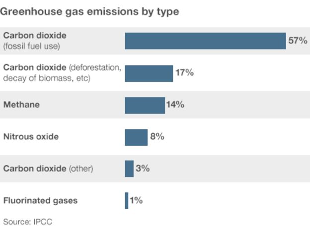

---
title: "Chapter 1"
author: "Felipe"
date: "Nov 13th, 2018"
output: html_document
---  

#What is climate change?  

The planet's climate has constantly been changing over geological time. The global average temperature today is about 15C, though geological evidence suggests it has been much higher and lower in the past.

However, the current period of warming is occurring more rapidly than many past events. Scientists are concerned that the natural fluctuation, or variability, is being overtaken by a rapid human-induced warming that has serious implications for the stability of the planet's climate.  


#What is the "greenhouse effect"?
The greenhouse effect refers to the way the Earth's atmosphere traps some of the energy from the Sun. Solar energy radiating back out to space from the Earth's surface is absorbed by atmospheric greenhouse gases and re-emitted in all directions.

The energy that radiates back down to the planet heats both the lower atmosphere and the surface. Without this effect, the Earth would be about 30C colder, making our planet hostile to life.  

```{r, echo=0}

```
*GHG emissions. Source: IPCC*


Scientists believe we are adding to the natural greenhouse effect with gases released from industry and agriculture (known as emissions), trapping more energy and increasing the temperature. This is commonly referred to as global warming or climate change.

The most important of these greenhouse gases in terms of its contribution to warming is water vapour, but concentrations show little change and it persists in the atmosphere for only a few days.

On the other hand, carbon dioxide (CO2) persists for much longer (it would take hundreds of years for it to return to pre-industrial levels). In addition, there is only so much CO2 that can be soaked up by natural reservoirs such as the oceans.

Most man-made emissions of CO2 are through the burning of fossil fuels, as well as through cutting down carbon-absorbing forests. Other greenhouse gases such as methane and nitrous oxide are also released through human activities, but their overall abundance is small compared with carbon dioxide.

Since the industrial revolution began in 1750, CO2 levels have risen by more than 30% and methane levels have risen more than 140%. The concentration of CO2 in the atmosphere is now higher than at any time in at least 800,000 years.
